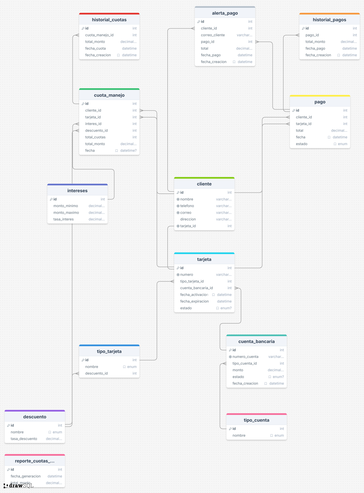
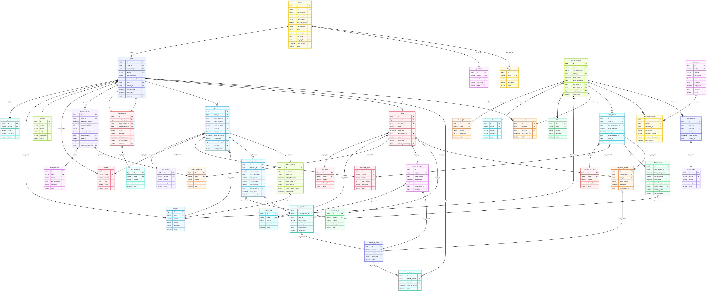
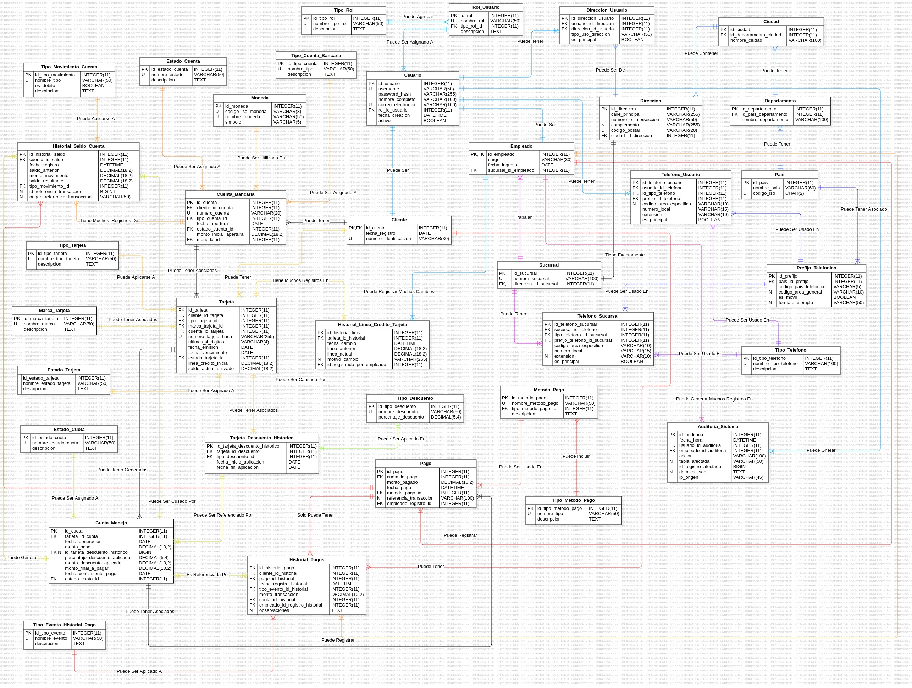
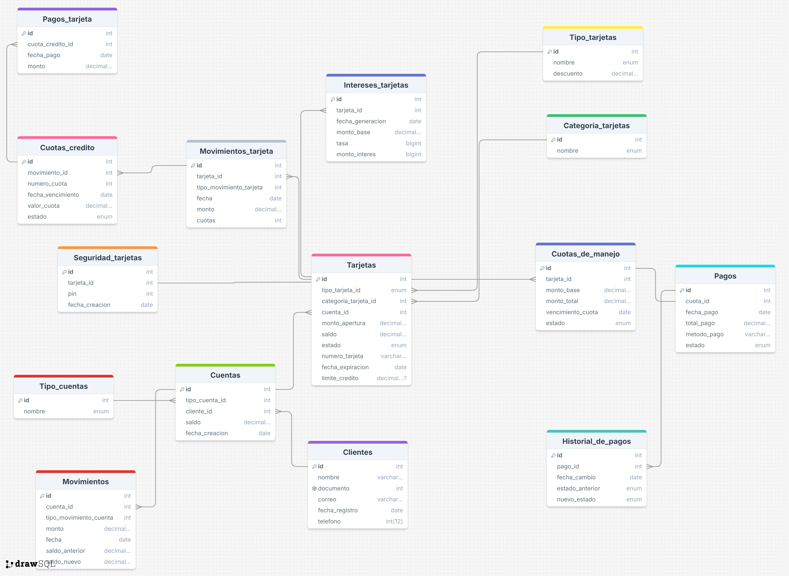

# Consultas_Puntos

## 1. Descripción del Proyecto
Repositorio con consultas SQL desarrolladas para un sistema bancario simulado. Cada consulta responde a diferentes puntos de análisis sobre clientes, tarjetas, pagos, cuotas de manejo y más.

## 2. Requisitos del Sistema
- MySQL 8+
- Editor compatible (VSCode, DBeaver, MySQL Workbench)

## 3. Instalación y Configuración
1. Clona el repositorio.
2. Carga el script SQL en tu gestor de base de datos.
3. Ejecuta por secciones para validar cada consulta.

## 4. Estructura de la Base de Datos
Incluye tablas como:
- `cliente`
- `tarjeta`
- `cuota_manejo`
- `pago`
- `historial_pagos`
- `descuento`
- `tipo_tarjeta`
- `cuenta_bancaria`

## 5. Ejemplos de Consultas
- Total de pagos por estado
- Tarjetas próximas a expirar
- Clientes más rentables
- Ingresos mensuales por tipo de tarjeta

## 6. Procedimientos, Funciones, Triggers y Eventos
(No aplican en este repositorio)

## 7. Contribuciones
Repositorio individual para prácticas académicas. No se reciben PRs por ahora.

## Diagramas
### Juan & Meliza

### Julian

### Kevin

### Santiago

Contacto: [GitHub de Nicolás](https://github.com/NicolasMuskusTarazona)
